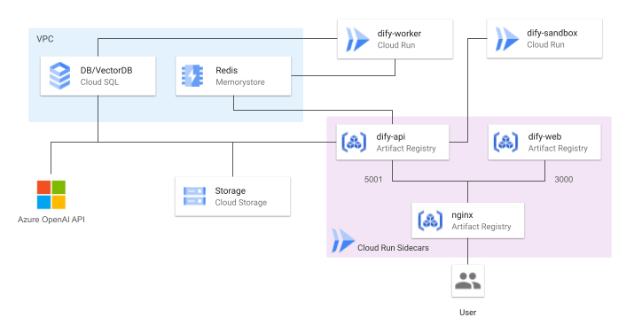

# 无效 20250303 有空再研究😭
# 原作者
https://github.com/DeNA/dify-google-cloud-terraform

## 修改的内容
问题：按照原作者的方式搭建后，登录后会发现一些地方的跳转url为127.0.0.1。
因此本次修改了5个参数的获取逻辑
```
CONSOLE_WEB_URL
CONSOLE_API_URL
SERVICE_API_URL
APP_API_URL
APP_WEB_URLs
FILES_URL
```
## 使用
1. 使用本项目的源码进行部署。在gcp控制台先给权限,根据自己的项目设置PROJECT_ID。
```
gcloud services enable \
    cloudresourcemanager.googleapis.com \
    compute.googleapis.com \
    servicenetworking.googleapis.com \
    sqladmin.googleapis.com \
    redis.googleapis.com \
    vpcaccess.googleapis.com \
    run.googleapis.com \
--project PROJECT_ID 
```
2. 然后按照原作者的说明一步步操作。最后控制台会打印`dify_service_urllllllllllllll`的值。复制后添加到`terraform/environments/dev/terraform.tfvars`中的`BASE_URL`
3. 重新部署

# Terraform for Dify on Google Cloud




<a href="./README_ja.md"></a>

## Overview
This repository allows you to automatically set up Google Cloud resources using Terraform and deploy Dify in a highly available configuration.

## Features
- Serverless hosting
- Auto-scaling
- Data persistence

## Prerequisites
- Google Cloud account
- Terraform installed
- gcloud CLI installed

## Configuration
- Set environment-specific values in the `terraform/environments/dev/terraform.tfvars` file.
- Create a GCS bucket to manage Terraform state in advance, and replace "your-tfstate-bucket" in the `terraform/environments/dev/provider.tf` file with the name of the created bucket.

## Getting Started
1. Clone the repository:
    ```sh
    git clone https://github.com/DeNA/dify-google-cloud-terraform.git
    ```

2. Initialize Terraform:
    ```sh
    cd terraform/environments/dev
    terraform init
    ```

3. Make Artifact Registry repository:
    ```sh
    terraform apply -target=module.registry
    ```

4. Build & push container images:
    ```sh
    cd ../../..
    sh ./docker/cloudbuild.sh <your-project-id> <your-region>
    ```
    You can also specify a version of the dify-api image.
    ```sh
    sh ./docker/cloudbuild.sh <your-project-id> <your-region> <dify-api-version>
    ```
    If no version is specified, the latest version is used by default.

5. Terraform plan:
    ```sh
    cd terraform/environments/dev
    terraform plan
    ```

6. Terraform apply:
    ```sh
    terraform apply
    ```


## Cleanup
```sh
terraform destroy
```

Note: Cloud Storage, Cloud SQL, VPC, and VPC Peering cannot be deleted with the `terraform destroy` command. These are critical resources for data persistence. Access the console and carefully delete them. After that, use the `terraform destroy` command to ensure all resources have been deleted.

## References
- [Dify](https://dify.ai/)
- [GitHub](https://github.com/langgenius/dify)

## License
This software is licensed under the MIT License. See the LICENSE file for more details.